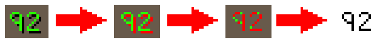

# SimpleOCR

SimpleOCR is a Simba plugin for reading text in Old School RuneScape originally developed by [@slackydev](https://github.com/slackydev/SimpleOCR).

The algorithm is very much designed for OSRS (blocky text with no anti-aliasing). Every pixel of the glyph must match for for a character to be recognized. 

The actual character recognition is quite similar to using Simba's `FindBitmap` for every character in the fontset.

----

## Exported Methods

```pascal
function TSimpleOCR.Recognize(Area: TBox; Filter: TOCRFilter; Font: TFontSet): String;
function TSimpleOCR.RecognizeStatic(Area: TBox; Filter: TOCRFilter; Font: TFontSet; MaxWalk: Integer = 20): String;
function TSimpleOCR.RecognizeLines(Area: TBox; Filter: TOCRFilter; Font: TFontSet; out TextBounds: TBoxArray): TStringArray; overload;
function TSimpleOCR.RecognizeLines(Area: TBox; Filter: TOCRFilter; Font: TFontSet): TStringArray; overload;
function TSimpleOCR.RecognizeUpText(Area: TBox; Filter: TOCRFilter; Font: TFontSet; MaxWalk: Integer = 20): String;
function TSimpleOCR.RecognizeNumber(Area: TBox; Filter: TOCRFilter; Font: TFontSet): Int64;

function TSimpleOCR.LocateText(Area: TBox; Font: TFontSet; Filter: TOCRFilter; out Bounds: TBox): Single; overload;
function TSimpleOCR.LocateText(Area: TBox; Font: TFontSet; out Bounds: TBox): Single; overload;
```

----

## Filters

- ### Color filter

  Basic color finding. 
  ```pascal
  function TOCRColorFilter.Create(Colors, Tolerances: TIntegerArray): TOCRColorFilter; static;
  function TOCRColorFilter.Create(Colors: TIntegerArray): TOCRColorFilter; static; overload;
  ```
  Example:
  ```pascal
  TOCRColorFilter.Create([$0000FF]); // Find color red
  ```
  
  
  Example with tolerance:
  ```pascal
  TOCRColorFilter.Create([$FFFFFF], [100]); // Find color white with 100 tolerance
  ```
  

  ---

- ### Invert Color Filter

  Basic color finding but inverted.
  ```pascal
  function TOCRInvertColorFilter.Create(Colors, Tolerances: TIntegerArray): TOCRInvertColorFilter; static; overload;
  function TOCRInvertColorFilter.Create(Colors: TIntegerArray): TOCRInvertColorFilter; static; overload;
  ```
  Example:
  ```pascal
  TOCRInvertColorFilter.Create([3358536, 0], [3, 10]); // Everything but brown and black (text shadow)
  ```
  

  ---

- ### Threshold Filter

  If a pixel brightness value is greater than a threshold amount, it is assigned white, else it is assigned black.
  ```pascal
  function TOCRThresholdFilter.Create(Amount: Integer; Invert: Boolean = False): TOCRThresholdFilter; static;
  ```
  Example:
  ```pascal
  TOCRThresholdFilter.Create(10); // Orange and red are brighter than the brown background
  ```
  

  ---

- ### Shadow Filter

  First shadows are found using average R,G,B value. `Shadow = (R+G+B div 3) < MaxShadowValue`

  Next shadow pixels are offset by -1,-1. The most common color from the offset pixels is used for the search color.
  ```pascal
  function TOCRShadowFilter.Create(MaxShadowValue: Integer = 25; Tolerance: Integer = 5): TOCRShadowFilter; static; 
  ```
  Example:
  ```pascal
  TOCRShadowFilter.Create();
  ```
  
  
----

## Locate Text

The `LocateText` function does **not** OCR! An image of the desired text is generated and searched for. Again quite similar to Simba's `FindBitmap`.
- A filter is not required if each pixel of the text is the exact same color. Although this is quite a lot slower.
- Will not work if the spacing between characters is dynamic.

